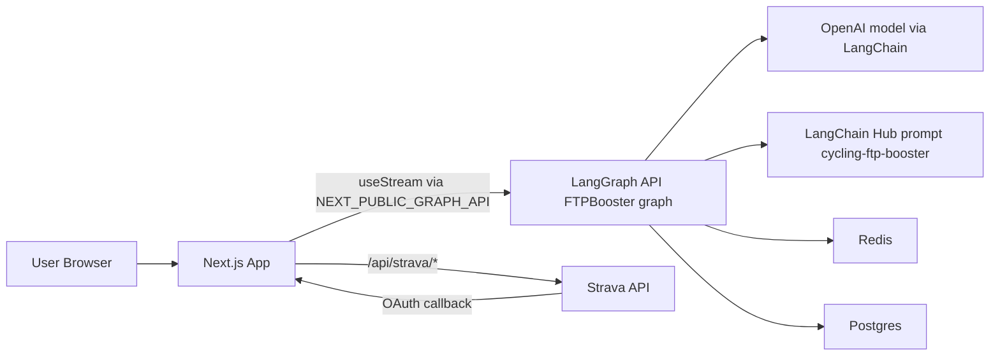
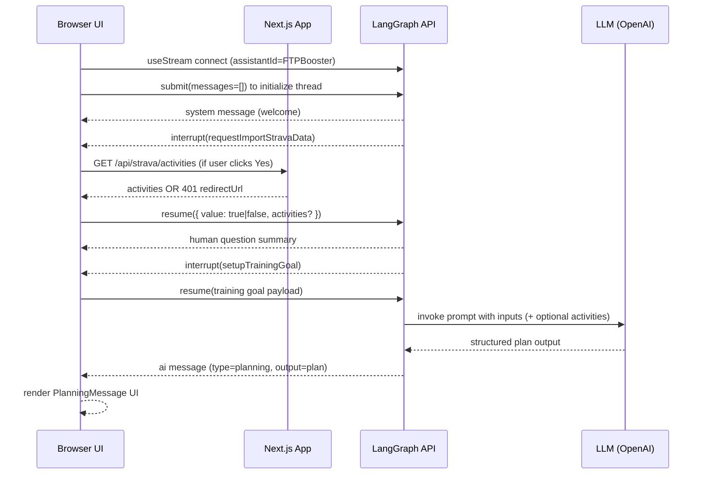
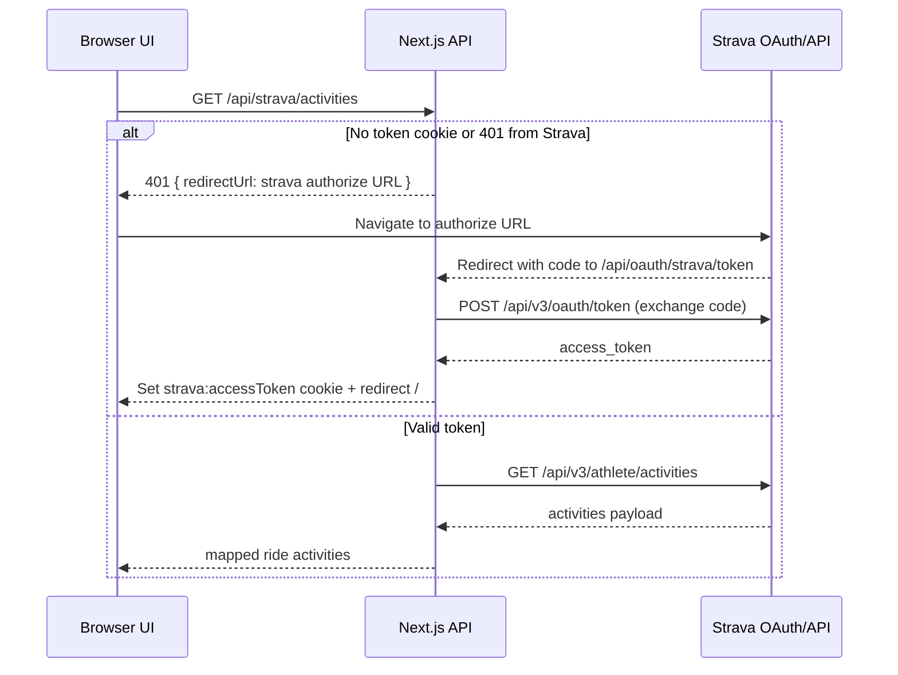

# FTP Booster Architecture

## Summary
FTP Booster is a Next.js App Router application that provides an interactive cycling training planner. The UI streams messages from a LangGraph assistant, collects user inputs through interrupt-driven forms, optionally imports Strava activities, and renders a structured multi-week FTP plan.

The architecture has two server boundaries:

1. `Next.js` app server for UI and Strava OAuth/API proxy routes.
2. `LangGraph API` runtime for conversation state, interrupts, and LLM plan generation.

## System Context

## Runtime Components

### 1. Next.js App (UI + API routes)
- Entry page renders a single agent component: `app/page.tsx`.
- Layout wraps UI providers (Chakra, Nuqs), analytics, and metadata: `app/layout.tsx`.
- Client agent view handles:
  - Graph stream setup and thread creation.
  - Rendering `system`, `human`, and `ai` messages.
  - Handling graph interrupts and resume payloads.
  - Strava connect flow kickoff through `/api/strava/activities`.

Key file: `components/cycling-ftp-booster-agent/index.tsx`.

### 2. LangGraph Workflow Service
- Graph name: `FTPBooster` (`langgraph.json`).
- Main graph definition: `graph/ftp-booster-graph.ts`.
- State fields:
  - `messages`: reduced with `messagesStateReducer`.
  - `trainingGoal`: typed form payload.
  - `isStravaDataImported`: decision from interrupt.
  - `activities`: imported Strava activity subset.
- Node sequence:
  1. `setupTrainingGoalTipsNode` (welcome system message)
  2. `requestImportStravaDataNode` (interrupt yes/no)
  3. Conditional:
     - `true` -> `importStravaActivitiesNode`
     - `false` -> `setupTrainingGoalNode`
  4. `setupTrainingGoalNode` (interrupt form values)
  5. `callCyclingFtpBoosterPromptNode` (Hub prompt + OpenAI)
  6. End
- Checkpointing uses `MemorySaver`.

### 3. Strava Integration Surface
- `/api/strava/activities`:
  - Reads `strava:accessToken` cookie.
  - If missing/unauthorized, returns `401` + OAuth authorize redirect URL.
  - If authorized, fetches athlete activities and returns a filtered/mapped `Ride` subset.
- `/api/oauth/strava/token`:
  - Exchanges authorization code for access token.
  - Persists `strava:accessToken` (httpOnly cookie).
  - Redirects back to `/`.
- `/api/strava/athlete`:
  - Proxy endpoint for athlete profile retrieval with bearer token.

## End-to-End Flows

### A) Initial Planning Conversation

### B) Strava OAuth Token Exchange

## State and Data Contracts

### Training Goal Schema
Defined in `utils/schema.ts`:
- `current`: number, positive, minimum 50.
- `target`: number, positive.
- `daysOfWeek`: number, positive.
- `hoursOfDay`: number, positive.
- `isConnectToStrava`: boolean (coerced).

### Plan Contract
Rendered by `components/cycling-ftp-booster-agent/planning-message.tsx` from `types/plan.d.ts`:
- `summary`
- `weeks[]`
  - `summary`
  - `days[]`
    - `details`
    - `stages[]` with `name`, `duration`, `intensity`, `color`.

### Message Content Conventions
- `ai` content variants:
  - `{ type: "text", text: string }`
  - `{ type: "planning", output: CyclingFtpBoosterPlan }`
- `human` content variant:
  - `{ type: "question", question: string, answer: string }`

## Configuration and Environment

| Variable | Used by | Purpose |
|---|---|---|
| `NEXT_PUBLIC_GRAPH_API` | `components/cycling-ftp-booster-agent/index.tsx` | Base URL for LangGraph streaming API. |
| `STRAVA_APP_CLIENT_ID` | `app/api/strava/activities/route.ts`, `app/api/oauth/strava/token/route.ts` | Builds OAuth authorize URL and token exchange payload. |
| `STRAVA_APP_CLIENT_SECRET` | `app/api/oauth/strava/token/route.ts` | OAuth code exchange secret. |
| `GOOGLE_ANALYTICS_ID` | `app/layout.tsx` | Enables Google Analytics script. |
| `LANGCHAIN_API_KEY` | `docker-compose.yaml` (`LANGSMITH_API_KEY`) | LangSmith/LangChain observability auth for graph container. |

## Deployment and Local Runtime

### Next.js App
- Scripts from `package.json`:
  - `pnpm dev`
  - `pnpm build`
  - `pnpm start`

### Graph Service
- Local graph dev: `pnpm dev:graph` (`langgraphjs dev`).
- Image build: `pnpm build:graph` (`langgraphjs build -t ftp-booster-graph`).
- Docker graph runtime:
  - `langgraph-api` container runs `ftp-booster-graph`.
  - Depends on `langgraph-redis` and `langgraph-postgres`.
  - `graph.Dockerfile` registers graph entry via `LANGSERVE_GRAPHS`.

## Known Risks and Gaps
1. OAuth callback control flow in `app/api/oauth/strava/token/route.ts` uses a `while` block for redirect, which is unusual and reduces readability/maintainability.
2. Strava token refresh lifecycle is not implemented; expired tokens rely on retry/reauth path.
3. `activities` in graph state is typed as `unknown[] | null`, which weakens type safety between API mapping and prompt inputs.
4. UI error states are minimal for stream failures and unexpected API responses.
5. `callCyclingFtpBoosterPromptNode` hardcodes model `"gpt-4o"`; no environment-based model selection path is documented.

## Architecture-Critical File Map
- `app/page.tsx`
- `app/layout.tsx`
- `components/cycling-ftp-booster-agent/index.tsx`
- `components/cycling-ftp-booster-agent/setup-training-goal-interrupt.tsx`
- `components/cycling-ftp-booster-agent/request-import-strava-data-interrupt.tsx`
- `components/cycling-ftp-booster-agent/planning-message.tsx`
- `graph/ftp-booster-graph.ts`
- `app/api/strava/activities/route.ts`
- `app/api/oauth/strava/token/route.ts`
- `app/api/strava/athlete/route.ts`
- `utils/schema.ts`
- `types/plan.d.ts`
- `types/strava.d.ts`
- `langgraph.json`
- `docker-compose.yaml`
- `graph.Dockerfile`
